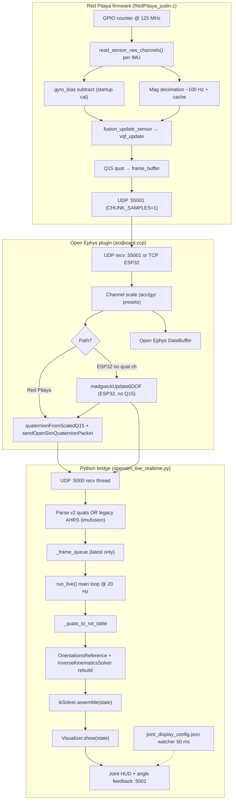

# VQF ↔ OpenSim IK Pipeline Map (Optimization-Oriented)

**Scope:** End-to-end orientation pipeline from Red Pitaya firmware through Open Ephys plugin to `opensim_live_realtime.py`. Analysis only — no implementation.

**Sources read:** `vqf.c`/`vqf.h`, `sensor_fusion.c`/`sensor_fusion.h`, `RedPitaya_justin.c`, `acqboard.ccp`, `opensim_live_realtime.py`, `docs/i2c-optimization-plan.md`.

---

## 1. End-to-End Pipeline

### 1.1 Mermaid (full path)



### 1.2 ASCII (latency-critical path)

```
IMU chip ──I2C/SPI──► raw int16 [acc,gyr,(mag)]
         │
         ├─ gyro_bias[] (200-sample startup mean, RedPitaya_justin.c:570-607)
         ├─ mag decimated: period = hw_hz/100 (472-501)
         │
         ▼
sensor_fusion.c: fusion_update_sensor()
         ├─ scale → float physical units
         ├─ vqf_update(gyr, acc)  [every accel/gyro tick]
         ├─ vqf_update_mag(mag)   [when mag_is_fresh]
         ├─ refresh_last_quaternion + normalize (again)
         └─ quat_float_to_q15 → channels [numRaw..numRaw+3]
         │
         ▼
UDP :55001  (1 sample/datagram, HEADER_SIZE=22 + payload)
         │
         ▼
acqboard.ccp run(): scale Q15 → float, pack UDP v2 → 127.0.0.1:5000
         │
         ▼
_udp_ahrs_thread(): drain stale packets, keep latest → _frame_queue
         │
         ▼
run_live() @ OPENSIM_LIVE_VISUALIZER_RATE (default 20 Hz):
         _quats_to_rot_table → NEW OrientationsReference + NEW IK solver → assemble → show
```

---

## 2. VQF / Fusion Deep Dive

### 2.1 Architecture layers

| Layer | File | Role |
|-------|------|------|
| VQF core | `vqf.c`, `vqf.h` | Daniel Laidig VQF (pure C port); 6D/9D AHRS, bias est, mag rejection |
| Wrapper | `sensor_fusion.c` | Multi-IMU slots, scaling, Q15 I/O, enable gate |
| Integration | `RedPitaya_justin.c` | Per-sample call, threading, timing stats, mag I/O |
| Alternate AHRS | `acqboard.ccp:184-245` | Inline Madgwick 6-DOF for ESP32 when no Q15 quat channels |

**Precision:** `vqf_real_t` defaults to **double** (`vqf.h:29-33`); Butterworth filter state always **double** (`vqf_filter_step`). `VQF_SINGLE_PRECISION` and `VQF_NO_MOTION_BIAS_ESTIMATION` are commented out.

### 2.2 Per-sample pseudocode (one IMU, fusion ON)

```
fusion_update_sensor(index, raw_acc, raw_gyr, raw_mag, mag_is_fresh, quat_q15):
    if not enabled → quat_q15 = identity Q15; return

    acc = raw_acc * accel_mps2_per_lsb
    gyr = raw_gyr * gyro_rads_per_lsb   // already bias-subtracted in firmware

    vqf_update(&vqf, gyr, acc):
        vqf_update_gyr:
            optional rest LP on gyro (if restBiasEst or magDistRejection)
            gyrNoBias = gyr - vqf.state.bias
            strapdown integrate → gyrQuat (cos/sin, quat multiply, normalize)

        vqf_update_acc:
            optional rest LP on acc; update restDetected timer
            rotate acc to Earth frame; Butterworth LP (tauAcc=3s)
            inclination correction → accQuat
            if motionBiasEst or restBiasEst:
                build 3×3 R from 6D quat
                Kalman-like bias update (3×3 inv, matrix multiplies)  ← HEAVY

    if has_mag and mag_is_fresh:
        vqf_update_mag → heading delta, disturbance rejection

    refresh_last_quaternion:
        vqf_get_quat_6d or _9d
        normalize_quaternion again                    ← redundant with VQF internal

    quat_float_to_q15(last_quat)
```

### 2.3 VQF default tuning (`vqf_params_init`, `vqf.c:42-73`)

| Parameter | Default | Effect |
|-----------|---------|--------|
| `tauAcc` | 3.0 s | Acc low-pass → inclination tracking speed |
| `tauMag` | 9.0 s | Heading correction time constant |
| `motionBiasEstEnabled` | true | 3×3 covariance bias update during motion |
| `restBiasEstEnabled` | true | Bias update when stationary ≥1.5 s |
| `magDistRejectionEnabled` | true | Reject bad mag; can zero heading gain up to 60 s |
| `restThGyr` / `restThAcc` | 2°/s, 0.5 m/s² | Rest detection thresholds |
| `biasClip` | 2°/s | Max estimated bias magnitude |

### 2.4 Firmware fusion integration

**Init:** `fusion_init(n, DESIRED_SAMPLE_RATE_HZ)` at startup (`RedPitaya_justin.c:1837`); **reinit on FREQ:** `reinit_fusion_for_hz()` (`1185-1204`, `1267`).

**Enable gate:** Plugin sends `FILTER ON` / `FILTER OFF` over TCP → `fusion_set_enabled()` (`1239-1247`).

**Parallelism:** `acquire_sensor_samples_decimated()` uses up to **5 worker pthreads + caller** for multi-IMU (`929-987`). Single IMU skips thread overhead (`953-959`).

**Decimation:** Per-sensor `cfg_target_hz` via hold buffer (`764-902`); VQF still runs only on decimated reads, but held quats repeat on skipped ticks.

**Instrumentation:** Per-call `clock_gettime` around `fusion_update_sensor`; reports avg/max µs every `current_stream_hw_hz()` samples (`1001-1017`). Loop warns if total sample path **>900 µs** (`992-998`).

**Gyro bias (firmware):** 200 samples × 10 ms sleep ≈ 2 s startup calibration (`38`, `570-607`), stored in `SensorInstance.gyro_bias[3]`, subtracted **before** VQF. VQF also runs its **own** gyro bias estimator — potential double correction / interaction.

**Mag path (MPU9250 I2C):** Separate I2C read to AK8963 every `hw_hz/100` samples (`472-501`); HOFL overflow reuses cache; values ×16 pre-scaled; `mag_units_per_lsb = 0.15/16` in `sensor_fusion.c:172`.

### 2.5 Madgwick path (plugin-only, ESP32)

When ESP32 stream has **≥6 channels but <11** (no Q15 quats) and `filterEnabled`:

```
dt = 1 / boardSampleRate
madgwickUpdate6DOF(q, gx, gy, gz, ax, ay, az, dt, beta=0.1)
→ sendOpenSimQuaternionPacket
```

- **6-DOF only** — yaw unobservable, will drift (`acqboard.ccp:171-177`).
- Runs **per sample on the PC**, not on device.
- Red Pitaya path uses **pre-fused VQF Q15** from firmware; no Madgwick on PC.

### 2.6 VQF CPU hotspots (qualitative)

| Hotspot | Location | Notes |
|---------|----------|-------|
| Motion bias 3×3 inverse | `vqf_update_acc` 489-504 | Every acc sample when enabled |
| Multiple Butterworth `vqf_filter_vec` | gyr/acc/rest/mag paths | Double-precision biquad |
| Trig (sin/cos/acos/asin/atan2) | gyr integration, acc/mag correction | Per sample |
| Extra normalize in wrapper | `sensor_fusion.c:106-122, 226` | sqrt + divide after VQF already normalized |
| I2C mag read | `read_sensor_raw_channels` | Blocks sample loop; not in VQF but serial with it |
| Q15 convert + clamp | `float_to_q15` per component | Minor |

---

## 3. OpenSim IK Pipeline Deep Dive

### 3.1 Threads

| Thread | Function | Blocking? |
|--------|----------|-----------|
| Main | `run_live()` — IK, viz, throttle | Blocks on `assemble` + `show` |
| UDP | `_udp_ahrs_thread()` | `recvfrom` 1 s timeout; drains burst with `select` |
| Joint display | `_joint_display_watcher_thread()` | `sleep(0.05)` poll on JSON mtime |

**Queue policy:** UDP thread **clears** `_frame_queue` and appends **one** latest frame (`686-688`, `849-851`). Main loop also clears after read (`1015-1016`). No backlog — intentional low latency, drops intermediate packets.

### 3.2 Main loop pseudocode (render path)

```
target_frame_s = 1 / LIVE_VISUALIZER_RATE   # default 20 Hz

loop:
    pop latest frame from _frame_queue (or sleep if empty)

    if t_imu <= last_t: continue              # monotonic time

    if now - t_last_solve < target_frame_s:    # viz throttle
        skip IK/render (still advances last_t)

    if tibia-only mode (1 sensor):
        ik_quats = live quats only
        lock all coords except knee_angle_r (+ beta)
    else:
        ik_quats = merge live into 8-slot neutral template
        ik_sensors = all 8 SENSORS names

    rot_table = _quats_to_rot_table(0, ik_quats, ik_sensors)

    # OpenSim 4.5 workaround — FULL REBUILD EVERY RENDERED FRAME:
    oRefs = OrientationsReference(rot_table)
    ikSolver = InverseKinematicsSolver(model, mRefs, oRefs, coordRefs, CONSTRAINT=20)
    ikSolver.setAccuracy(1e-4)
    state.setTime(0)
    apply_tibia_only_locks(...)
    ikSolver.assemble(state)                  ← dominant cost
    state.setTime(t_imu)

    read display joint angle; HUD; UDP feedback :5001
    model.getVisualizer().show(state)

    log [PERF] avg frame ms every 1 s
```

### 3.3 Legacy IMU path (non-v2 packets)

If packet is **not** v2 quaternions, UDP thread runs **imufusion** per slot (`809-819`):

- `imufusion.Offset(SAMPLE_RATE=1000)` gyro calibration
- `Ahrs.update_no_magnetometer` — **second fusion** after firmware/plugin already fused
- Only used when bridge receives raw acc/gyro floats, not quaternion v2

### 3.4 Coordinate / constraint model

- `CONSTRAINT = 20.0` (`opensim_live_realtime.py:76`) — orientation constraint weight in IK
- `ikSolver.setAccuracy(1e-4)` (`957`, `1078`)
- Neutral pose: 8-IMU template `_NEUTRAL_QUATS_8IMU` merged for partial sensor sets
- Frame fix: `_Q_OPENSIM_FRAME = Rx(-π/2)` applied to all incoming quats
- Tibia-only: locks all coords except `knee_angle_r` / `knee_angle_r_beta` (`886-926`)

---

## 4. Data Rates & Timing

### 4.1 Rate table

| Stage | Default | Range | Notes |
|-------|---------|-------|-------|
| Hardware stream tick | 100 Hz | 1–2000 Hz | `g_stream_hw_hz`, `DESIRED_SAMPLE_RATE_HZ=100` |
| Per-sensor ODR target | = hw_hz | ≤ hw_hz | `CFG n SRATE`; BNO055 fixed ~100 Hz |
| Per-sensor decimation | 1× | hw/target | Hold-last-sample between reads |
| Mag effective rate | ~100 Hz | — | `mag_period = hw_hz/100` |
| VQF update rate | = effective sensor read rate | — | Once per `fusion_update_sensor` |
| UDP firmware → plugin | = stream Hz | — | `CHUNK_SAMPLES=1` |
| Plugin → OpenSim | = stream Hz | — | One v2 packet per sample (RP path) |
| OpenSim render / IK | 20 Hz | env `OPENSIM_LIVE_VISUALIZER_RATE` | Throttle in main loop |
| Joint config poll | 20 Hz | — | 50 ms sleep |
| Angle feedback UDP | 20 Hz | — | Tied to rendered frames |
| imufusion offset window | 1000 Hz nominal | — | `SAMPLE_RATE=1000` constant |

### 4.2 Latency budget (typical @ 100 Hz stream, 20 Hz viz)

| Segment | Est. delay | Blocking? |
|---------|------------|-----------|
| IMU sample → VQF | 0.05–0.9 ms | Yes, in sample loop |
| Frame → UDP send | <0.1 ms | Same loop |
| UDP → plugin recv | 0–10 ms | OS scheduling |
| Plugin → Python :5000 | <1 ms | localhost |
| UDP thread → queue | <1 ms | Drains burst, keeps latest |
| Queue → IK (throttle) | 0–50 ms | Waits for 20 Hz slot |
| `_quats_to_rot_table` | ~1–5 ms | Logged as `avg convert` |
| IK solver rebuild + assemble | **10–80+ ms** | **Primary bottleneck** |
| `show(state)` | 5–30 ms | GPU/Simbody |
| **End-to-end (packet → pixel)** | **~50–150 ms** | Dominated by viz throttle + IK |

Render lag is explicitly logged: `render_lag_ms = now - packet_wall_time` (`1057`).

### 4.3 Where blocking happens

1. **Firmware:** I2C/SPI reads + VQF in GPIO-paced loop (must finish before next tick).
2. **Plugin:** TCP/UDP read loop; per-packet Q15 decode + optional Madgwick (ESP32).
3. **Python main thread:** `InverseKinematicsSolver` construction + `assemble` + `show` — **cannot overlap with viz** on same thread.
4. **Python UDP thread:** Independent; only contends on `_frame_lock`.

---

## 5. Parameter Inventory

### 5.1 Firmware / VQF

| Parameter | Value | File:Line |
|-----------|-------|-----------|
| `DESIRED_SAMPLE_RATE_HZ` | 100 | `RedPitaya_justin.c:34` |
| `g_stream_hw_hz` max | 2000 | `RedPitaya_justin.c:64` |
| `CTR_CLK_RATE` | 125 MHz | `RedPitaya_justin.c:35` |
| `GYRO_BIAS_CALIBRATION_SAMPLES` | 200 | `RedPitaya_justin.c:38` |
| Gyro cal sleep | 10 ms/sample | `RedPitaya_justin.c:594` |
| `UDP_PORT` (data) | 55001 | `RedPitaya_justin.c:54` |
| `CHUNK_SAMPLES` | 1 | `RedPitaya_justin.c:55` |
| `HEADER_SIZE` | 22 | `RedPitaya_justin.c:36` |
| Loop slow warning | 900 µs | `RedPitaya_justin.c:996` |
| Mag decimation | `hw_hz/100` | `RedPitaya_justin.c:472-473` |
| Mag pre-scale | ×16 | `RedPitaya_justin.c:487-490` |
| `FUSION_QUAT_Q15_SCALE` | 32767 | `sensor_fusion.h:29` |
| Default acc scale | 9.80665/16384 m/s²/LSB | `sensor_fusion.c:156` |
| Default gyro scale | (1/131)°/s → rad/s | `sensor_fusion.c:157` |
| MPU9250 mag scale | 0.15/16 µT/LSB | `sensor_fusion.c:172` |
| Mag sample rate cfg | 100 Hz | `sensor_fusion.c:159,173,181,189` |
| `VQFParams` defaults | see §2.3 | `vqf.c:42-73` |
| `VQF_SINGLE_PRECISION` | **off** | `vqf.h:18` |
| `VQF_NO_MOTION_BIAS_ESTIMATION` | **off** | `vqf.h:19` |

### 5.2 Plugin

| Parameter | Value | File:Line |
|-----------|-------|-----------|
| Default `boardSampleRate` | 1000 (ctor), often 100 | `acqboard.ccp:255,385` |
| `samplesPerBuffer` | max(1, round(rate/1000)) | `acqboard.ccp:1788-1790` |
| Madgwick `beta` | 0.1 | `acqboard.ccp:1897` |
| Q15 scale | 1/32767 | `acqboard.ccp:153,1941` |
| OpenSim UDP port | 5000 | `acqboard.ccp:1766` |
| UDP v2 version | 2.0 | `acqboard.ccp:1760` |
| ESP32 OpenSim gate | `openSimEnabled && filterEnabled` | `acqboard.ccp:1876` |
| Red Pitaya OpenSim gate | `openSimEnabled` only | `acqboard.ccp:2110` |
| FREQ command range | 1–2000 Hz | `acqboard.ccp:837` |

### 5.3 Python / OpenSim

| Parameter | Value | File:Line |
|-----------|-------|-----------|
| `SAMPLE_RATE` | 1000.0 | `opensim_live_realtime.py:74` |
| `LIVE_VISUALIZER_RATE` | 20 (env override) | `opensim_live_realtime.py:75` |
| `CONSTRAINT` | 20.0 | `opensim_live_realtime.py:76` |
| IK accuracy | 1e-4 | `opensim_live_realtime.py:957,1078` |
| `NO_DATA_TIMEOUT_S` | 5.0 | `opensim_live_realtime.py:82` |
| `STALE_PACKET_S` | 0.2 | `opensim_live_realtime.py:84` |
| `SESSION_GAP_S` | 0.5 | `opensim_live_realtime.py:83` |
| Static detection | gyro<0.5, change<0.02 | `opensim_live_realtime.py:86-88` |
| Joint watcher poll | 50 ms | `opensim_live_realtime.py:355` |
| Display joint reload | every 25 frames | `opensim_live_realtime.py:1094-1095` |
| Angle feedback port | 5001 | `opensim_live_realtime.py:46` |
| Main idle sleep | 5 ms | `opensim_live_realtime.py:1033,1047` |

---

## 6. Redundant / Duplicate Work

| Duplication | Impact |
|-------------|--------|
| Firmware gyro_bias + VQF bias estimator | Possible over-correction; two calibrators |
| `normalize_quaternion` after VQF get | Extra sqrt per sensor per sample |
| imufusion AHRS on legacy path after RP VQF | Full second fusion (avoid when on v2) |
| IK solver + OrientationsReference rebuild every frame | **Largest Python cost** |
| Neutral merge copies 8 quats when partial sensor set | Extra Python list ops; needed for IK labels |
| Red Pitaya sends OpenSim UDP even when FILTER OFF | Identity quats still forwarded (`2110`) |
| `_load_display_joint(reload=True)` every 25 frames | Disk stat + JSON parse in hot path |

---

## 7. Optimization Matrix

Ranked by **ROI** (impact ÷ effort). Impact: H/M/L. Effort: H/M/L. Risk: correctness / drift / platform.

| # | Opportunity | Impact | Effort | Risk | Suggested approach |
|---|-------------|--------|--------|------|-------------------|
| 1 | **Stop rebuilding IK solver every frame** | H | M | M | Cache `InverseKinematicsSolver`; update orientations via `BufferedOrientationsReference` or `OrientationsReference` row API; verify OpenSim 4.5 Python bindings with spike. Comment at `1072-1075` documents the workaround. |
| 2 | **Enable `VQF_NO_MOTION_BIAS_ESTIMATION` on embedded** | H | L | M | Cuts 3×3 matrix inverse per acc sample; keep rest bias only. Measure heading drift on hardware. |
| 3 | **Enable `VQF_SINGLE_PRECISION`** | M | L | L | Halves VQF state/memory; filters stay double. Benchmark on RP ARM. |
| 4 | **Remove wrapper re-normalize** | L | L | L | Trust VQF output or normalize once in `quat_float_to_q15`. |
| 5 | **Skip duplicate gyro bias** | M | L | M | Choose firmware static bias **or** VQF bias est, not both; or seed VQF via `vqf_set_bias_estimate`. |
| 6 | **Reduce OpenSim render rate adaptively** | M | L | L | Already throttled to 20 Hz; expose UI/env; skip `show` if coord delta < ε. |
| 7 | **I2C mag batch / async read** | M | H | M | See `docs/i2c-optimization-plan.md`; mag already decimated but I2C still serial in read path. |
| 8 | **Gate Red Pitaya OpenSim on `filterEnabled`** | L | L | L | Match ESP32 behavior (`1876`); avoid identity-quat spam when filter off. |
| 9 | **Avoid imufusion on v2-only deployments** | M | L | L | Compile-time or env flag to disable legacy AHRS branch entirely. |
| 10 | **Tune VQF time constants for live viz** | M | M | M | Lower `tauAcc` (snappier tilt), raise `tauMag` (less mag fighting) for lab environments. |
| 11 | **Joint display: event-driven watcher** | L | L | L | Replace 50 ms poll with plugin-side UDP trigger or `watchdog` on write. |
| 12 | **Multi-IMU VQF: disable threads for ≤2 IMUs** | L | L | L | Thread sem overhead may exceed work; profile at target sensor count. |
| 13 | **Increase `CHUNK_SAMPLES` at high Hz** | L | L | M | Reduces UDP overhead at 1 kHz; adds latency = chunk_size/rate. |
| 14 | **Cache `_load_display_joint`** | L | L | L | Reload on watcher signal only, not every 25 frames. |

---

## 8. Top Recommendations (ROI order)

### #1 — Fix IK solver lifetime (Python)
Reconstructing `InverseKinematicsSolver` + `OrientationsReference` on **every** 20 Hz frame dominates `[PERF]` logs. A one-time solver with mutable orientation input is the single largest win for live latency and CPU.

### #2 — Slim VQF on firmware
Define `VQF_NO_MOTION_BIAS_ESTIMATION` (and optionally `VQF_SINGLE_PRECISION`) for Red Pitaya builds. Motion bias Kalman update is the heaviest per-sample VQF block; firmware already calibrates static gyro bias.

### #3 — Align fusion paths and rates
- Ensure production uses **UDP v2 quaternions** end-to-end (skip imufusion).
- Match `fusion_init` sample rate to actual `g_stream_hw_hz` at START (already on FREQ; verify at stream begin).
- Consider lowering stream rate to 100–200 Hz for OpenSim (20 Hz viz) — saves VQF + network + plugin work with no visual loss.

---

## 9. Measurement Checklist (before/after)

| Metric | Where to read |
|--------|----------------|
| VQF avg/max µs | RP console: `VQF filter time over last N calls` |
| Sample loop us | RP console: `WARNING: loop took N us` |
| IK frame ms | Python: `[PERF] avg frame=... avg convert=...` |
| Render lag | Python: `[LIVE-RENDER] render_lag_ms=...` |
| End-to-end | Compare packet timestamp vs `state.getTime()` on logged frames |

---

## 10. File Reference Map

```
vqf.h / vqf.c              — VQF algorithm + params
sensor_fusion.h / .c       — Multi-IMU wrapper, Q15
RedPitaya_justin.c         — Acquisition, VQF call site, UDP stream
acqboard.ccp               — Plugin bridge, Madgwick, OpenSim UDP v2
opensim_live_realtime.py   — IK loop, viz throttle, HUD
docs/i2c-optimization-plan.md — Planned firmware I/O optimizations
docs/opensim-udp-v2.md     — Packet format
```

---

*Generated: 2026-06-10 — analysis only, no code changes.*
