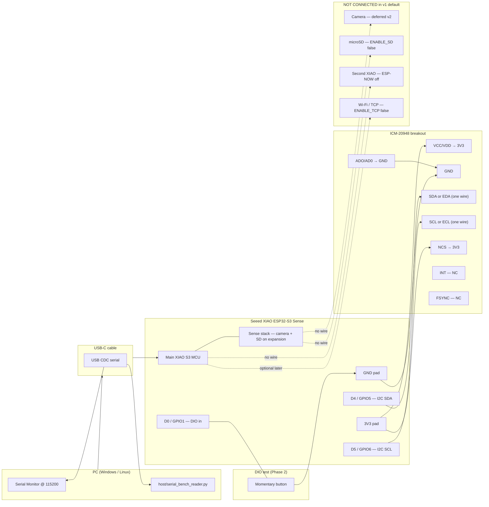

# ESP32-S3 STEP — Wiring Diagram (v1.3.0)

Single-board **USB bench** wiring for Seeed **XIAO ESP32-S3 Sense**: ICM-20948 IMU, optional DIO button, serial output to PC. Matches `arduino/step_node/step_node.ino` v1.3.0 defaults (`ENABLE_TCP false`, `ENABLE_SERIAL_BENCH true`).

Sketch reference: [arduino-ide-guide.md](arduino-ide-guide.md) · Phase 2 DIO test: [Phase 2 section](arduino-ide-guide.md#phase-2-test-dio-over-usb)

---

## Board layout note (XIAO ESP32-S3 Sense)

The **Sense** variant stacks a camera/SD expansion on the main XIAO. For v1 IMU bring-up:

- Run **four I2C wires** from the **edge pads** on the stacked assembly: **3V3**, **GND**, **D4**, **D5** — these route to the main XIAO GPIOs (same as the pin table below).
- Do **not** rely on undocumented pads on the expansion board; use the labeled **D4/D5/3V3/GND** edge connections to your ICM breakout.

---

## Mermaid wiring diagram



**Legend:** solid lines = connect for v1 USB bench · dashed = intentionally unwired / optional later

---

## ASCII wiring diagram

```
                    ┌─────────────────────────────────────────────────────────┐
                    │              PC (USB host)                               │
                    │   Serial Monitor 115200  |  serial_bench_reader.py COMx │
                    └───────────────────────────┬─────────────────────────────┘
                                                │ USB-C (data + power)
                                                ▼
┌───────────────────────────────────────────────────────────────────────────────┐
│                    Seeed XIAO ESP32-S3 Sense (stacked)                        │
│  ┌─────────────────────────────┐   ┌──────────────────────────────────────┐ │
│  │  Main XIAO ESP32-S3         │   │  Sense expansion (on stack)          │ │
│  │  step_node.ino v1.3.0       │   │  Camera  ─── NOT CONNECTED (v2)      │ │
│  │  100 Hz CSV on USB Serial   │   │  microSD ─── NOT CONNECTED (v1)      │ │
│  └─────────────────────────────┘   └──────────────────────────────────────┘ │
│                                                                               │
│  Edge pads (use these for ICM):                                               │
│    3V3 ────────────────┐                                                      │
│    GND ────────────────┼───────────────┐                                      │
│    D4  (GPIO5, SDA) ───┼───┐           │                                      │
│    D5  (GPIO6, SCL) ───┼───┼───┐       │                                      │
│    D0  (GPIO1, DIO) ───┼───┼───┼───┐   │                                      │
└────────────────────────┼───┼───┼───┼───┼──────────────────────────────────────┘
                         │   │   │   │   │
              ┌──────────┘   │   │   │   └──────────┐
              │              │   │   │              │
              ▼              ▼   ▼   ▼              ▼
        ┌─────────────────────────────────────────────┐    ┌─────────────┐
        │  ICM-20948 (dual silk — wire each net once) │    │  Momentary  │
        │  VCC/VDD ◄── 3V3                            │    │   button    │
        │  GND     ◄── GND                            │    │  (optional) │
        │  SDA or EDA ◄── D4 (not both!)              │    └──────┬──────┘
        │  SCL or ECL ◄── D5 (not both!)              │           │
        │  AD0/ADO ──► GND  (addr 0x68)               │           │
        │  NCS ──► 3V3   INT/FSYNC — NC               │           │
        └─────────────────────────────────────────────┘           │
              ▲                                                    │
              └──────── D0 (GPIO1) ──── button ────────────────────┘
                         other leg → GND (internal pull-up on D0)

  NOT CONNECTED (v1 default sketch):
    • Second XIAO board     (ENABLE_ESPNOW false)
    • Wi-Fi router / TCP    (ENABLE_TCP false — USB bench only)
    • Camera on Sense stack (deferred v2 — see camera-feasibility.md)
    • microSD on Sense      (ENABLE_SD false)
```

---

## ICM-20948 module labels (EDA / ECL silk)

Many breakouts print **two naming schemes on the same PCB** — they are **the same electrical nets**, not separate buses:

| Common silk | InvenSense silk | Same signal |
|-------------|-----------------|-------------|
| **SDA** | **EDA** | I2C data → XIAO **D4** / GPIO5 |
| **SCL** | **ECL** | I2C clock → XIAO **D5** / GPIO6 |
| **AD0** | **ADO** | I2C address select |
| **VCC** / **VDD** | *(often only on one row)* | Power → XIAO **3V3** |
| **GND** | *(often only on one row)* | Ground → XIAO **GND** |

**Do not duplicate wires** — pick **one** label per function. Example: wire XIAO **D4** to **either** the pad marked **SDA** **or** **EDA**, not both.

Extra pins on the InvenSense row (not on the simple 4-wire bus):

| Module label | Connect to | Notes |
|--------------|------------|-------|
| **ADO** (= AD0) | **GND** (0x68) or **3V3** (0x69) | Your working setup: **ADO→GND** |
| **NCS** | **3V3** | **Required for I2C** — tie high; disables SPI on shared pins |
| **INT** | *leave unconnected* | Optional GPIO interrupt; not needed for 100 Hz streaming |
| **FSYNC** | *leave unconnected* or **GND** | Optional; not used in v1 sketch |

> **Power pins:** If **VCC/GND** are not next to EDA/ECL on the header, they are usually on the **same breakout** under labels **VCC**, **VDD**, **3V3**, or **GND** (sometimes **bottom of PCB**). You still need **one** 3V3 and **one** GND — do not wire both SDA and EDA thinking they are different data lines.

### Pin mapping (I2C mode) — use once per signal

| Module label | Connect to | Notes |
|--------------|------------|-------|
| **VCC / VDD** *(or power row)* | XIAO **3V3** | 3.3 V only — **not 5 V** |
| **GND** | XIAO **GND** | Common ground |
| **SDA** *or* **EDA** | XIAO **D4** (GPIO5) | I2C data — **one wire only** |
| **SCL** *or* **ECL** | XIAO **D5** (GPIO6) | I2C clock — **one wire only** |
| **AD0** *or* **ADO** | **GND** (0x68) or **3V3** (0x69) | Set `#define ICM20948_ADDR 0x68` when ADO→GND |
| **NCS** | **3V3** | Required on boards that expose it |
| **INT** | NC | Optional |
| **FSYNC** | NC or GND | Optional |

Set `#define ICM20948_ADDR 0x68` in the sketch when **ADO/AD0→GND** (user-confirmed working address).

---

## Pin table (sketch v1.3.0)

| Sketch define | GPIO | XIAO pad | Connect to | Firmware channel / role |
|---------------|------|----------|------------|-------------------------|
| *(power)* | — | **3V3** | ICM **VCC/VDD**, **NCS** | 3.3 V only — **not 5 V** |
| *(ground)* | — | **GND** | ICM **GND**, **ADO** (for 0x68), button leg | Common ground |
| `PIN_I2C_SDA` **5** | 5 | **D4** | ICM **EDA** (= SDA) | I2C data → IMU ch0–5 source |
| `PIN_I2C_SCL` **6** | 6 | **D5** | ICM **ECL** (= SCL) | I2C clock |
| `PIN_DIO` **1** | 1 | **D0** | Button → **GND** on press | ch6: bit0=level, bits1–15=edges |
| `ICM20948_ADDR` | — | — | **`0x68`** if ADO→GND; **`0x69`** if ADO→3V3 | Boot I2C scan |
| *(module)* | — | — | **NCS → 3V3** | Required for I2C mode on EDA/ECL boards |
| *(module)* | — | — | **INT**, **FSYNC** unconnected | OK for v1 streaming |
| `PIN_SD_CS` **21** | 21 | *(Sense)* | **Not wired** (`ENABLE_SD false`) | Phase 4 |
| *(USB)* | — | **USB-C** | PC | Serial bench @ 115200 |

### Default feature flags (v1.3.0 repo)

| Define | Default | v1 wiring implication |
|--------|---------|------------------------|
| `ENABLE_SERIAL_BENCH` | **true** | USB CSV to PC — **wire USB-C** |
| `ENABLE_TCP` | **false** | No router required |
| `ENABLE_ESPNOW` | **false** | **One board only** — no second node |
| `ENABLE_SD` | **false** | **Do not wire SD** for v1 bench |
| Camera | — | **Not used** — see [camera-feasibility.md](camera-feasibility.md) |

### Open Ephys channel map (after wiring)

| Ch | Source | Notes |
|----|--------|-------|
| 0–5 | ICM-20948 | ax, ay, az, gx, gy, gz (int16) |
| 6 | `PIN_DIO` | Level + debounced edge count |
| 7 | — | 0 in v1 (camera reserved v2) |

---

## Quick checks

1. **Boot:** `DIO: GPIO1 (pad D0) pull-up — initial level=1` and `ICM20948: OK at I2C 0x68` (or 0x69 if AD0 high).
2. **IMU:** CSV columns ax–gz change when you move the board.
3. **DIO:** Press button D0→GND → CSV **ch6** (8th field) level bit goes **1→0** within ~20 ms.

---

## See also

- [Arduino IDE guide](arduino-ide-guide.md) — flash, USB bench, Phase 2 DIO test
- [camera-feasibility.md](camera-feasibility.md) — why camera is v2
- [Seeed XIAO ESP32S3 pin multiplexing](https://wiki.seeedstudio.com/xiao_esp32s3_pin_multiplexing/)
